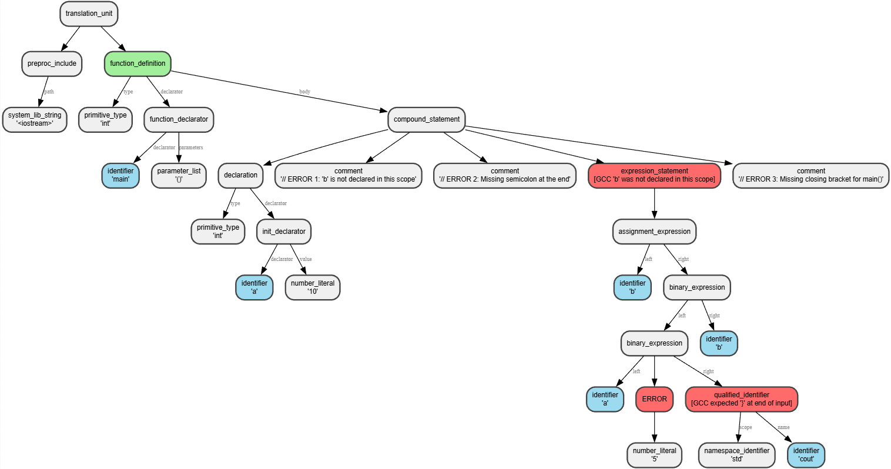
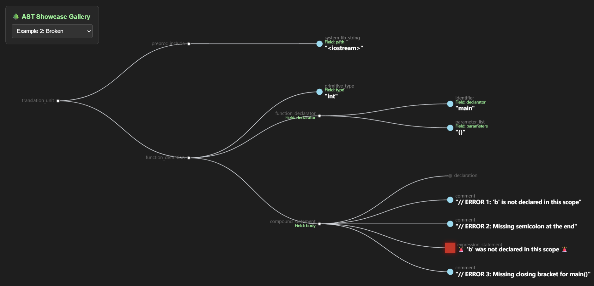

# 🌳 C++ AST Visualizer & Diagnostic Engine

> A systems-level C++ parsing engine that generates, analyzes, and visualizes Abstract Syntax Trees from raw source code — with embedded GCC compiler diagnostics mapped directly onto tree nodes.

<p align="center">
  
  &nbsp;
  
  &nbsp;
  
  &nbsp;
  <a href="https://Sukhjot-SinghS.github.io/Ast-Visualizer/frontend/">
    
  </a>
</p>

---

<p align="center">
  
  &nbsp;
  
</p>

<p align="center">
  <sub>Left: Static SVG export via Graphviz &nbsp;|&nbsp; Right: Interactive Web UI with ECharts</sub>
</p>

---

## 🎯 The Problem

Building developer tools — linters, formatters, static analyzers, or autocomplete engines — requires a deep understanding of Abstract Syntax Trees.

When source code is syntactically broken, standard parsers generate fragmented error nodes. For tooling engineers and students studying compiler design, visualizing exactly **how a parser recovers from real-world errors** is a tedious, manual process of reading raw S-expressions.

## 💡 The Solution

This diagnostic utility is built specifically for parser and tooling development:

1. **Parses** C++ source into an AST using Tree-sitter
2. **Intercepts** raw GCC compiler diagnostics via `stderr`
3. **Maps** semantic errors directly onto the exact AST nodes where recovery occurred
4. **Visualizes** the enriched tree in two formats:
   - **Interactive Web UI** — pan, zoom, and inspect nodes in the browser
   - **Static SVG Diagram** — embed in docs, papers, or presentations

**Result:** Instead of parsing raw terminal output, engineers can *visually inspect* how syntactic structures degrade and map to compiler complaints.

---

## 🏗️ Architecture

```
Input: C++ Source Code
        ↓
┌───────────────────────────┐
│  Tree-sitter Parser (C)   │  →  Generates Concrete Syntax Tree
└───────────┬───────────────┘
            │
┌───────────▼───────────────┐
│  AST Construction         │  →  Cursor-based traversal
└───────────┬───────────────┘
            │
┌───────────▼──────────────────────┐
│  GCC Diagnostic Hooking          │
│  $ g++ -fsyntax-only file.cpp    │  →  Captures stderr
└───────────┬──────────────────────┘
            │
┌───────────▼──────────────────────┐
│  Error → AST Node Mapping        │  →  Regex parsing, line-to-node matching
└───────────┬──────────────────────┘
            │
       ┌────┴────────┐
       │             │
┌──────▼───────┐  ┌──▼──────────────┐
│  JSON Export │  │  SVG Export     │
│  (Web UI)    │  │  (via DOT)      │
└──────┬───────┘  └──┬──────────────┘
       │             │
┌──────▼──────────┐  ┌▼──────────────┐
│ frontend/       │  │ file_viz.svg  │
│ file_code.json  │  └───────────────┘
└──────┬──────────┘
       │
┌──────▼────────────────────┐
│  index.html (ECharts)     │  →  Interactive web visualization
│  · Pan / Zoom tree        │
│  · Click nodes to expand  │
│  · Red nodes = errors     │
└───────────────────────────┘
```

---

## 🛠️ Technical Stack

| Component | Technology | Purpose |
|---|---|---|
| Core Language | C++17 | Performance + modern features |
| Parser | Tree-sitter (C API) | Industry-standard incremental parsing |
| JSON Library | nlohmann/json | Header-only, clean API |
| Compiler Hook | GCC (`g++ -fsyntax-only`) | Real semantic diagnostics |
| Visualization | Apache ECharts | Interactive, production-grade charts |
| Graph Export | Graphviz DOT → SVG | Static diagrams for documentation |
| Hosting | GitHub Pages | Free, zero-setup deployment |

---

## 📦 Installation & Build

### Prerequisites

**All Platforms:**
- C++17 compiler (GCC 7+, Clang 5+, MSVC 2017+)
- Git

**Optional** (for SVG generation):
- Graphviz (`dot` command)

---

### Quick Start — 3 Steps

#### 1. Clone the Repository

```bash
git clone https://github.com/yourusername/ast-visualizer.git
cd ast-visualizer
```

#### 2. Compile

The project vendors Tree-sitter directly in the root — no external dependencies needed.

**Linux / macOS:**
```bash
g++ -std=c++17 src/main.cpp \
    parser.o scanner.o tree-sitter.o \
    -I tree-sitter/lib/include \
    -o ast-viz
```

**Windows (MinGW / MSYS2):**
```bash
g++ -std=c++17 src/main.cpp ^
    parser.o scanner.o tree-sitter.o ^
    -I tree-sitter/lib/include ^
    -o ast-viz.exe
```

#### 3. Verify Installation

```bash
./ast-viz --help
```

Expected output:
```
Usage: ./ast-viz <path_to_cpp_file> [--dot]
```

---

### Optional: Install Graphviz (for SVG diagrams)

| Platform | Command |
|---|---|
| macOS | `brew install graphviz` |
| Linux (Ubuntu/Debian) | `sudo apt-get install graphviz` |
| Windows | `winget install graphviz` |

Verify with `dot -V` — should print the installed version.

---

## 🚀 Usage

### Mode 1 — Interactive Web Visualization (Default)

**Generate AST + Diagnostics:**
```bash
./ast-viz test_files/clean.cpp
./ast-viz test_files/broken.cpp
./ast-viz test_files/complex.cpp
```

**Output:**
```
Generated: frontend/clean_code.json
Generated: frontend/broken_code.json
Generated: frontend/complex_code.json
```

**View the diagram:**

Open `frontend/index.html` in any modern browser. Use the dropdown to switch between examples.

| Control | Action |
|---|---|
| Click + Drag | Pan |
| Scroll Wheel | Zoom |
| Click Node | Expand / Collapse |
| Hover | Show details |

**Node colors:**
- 🔘 **Dark gray** — Grammar / structure nodes, click to expand them 
- 🔵 **Light blue** — Source code tokens (identifiers, literals)
- 🔴 **Red box** — Compiler errors with GCC diagnostic messages

---

### Mode 2 — Static SVG Export

```bash
./ast-viz test_files/complex.cpp --dot
```

**Output:**
```
Generated: complex_viz.svg
```

The SVG shows the full AST as a static graph with color-coded nodes and edge labels. Intermediate `.dot` files are automatically cleaned up. The SVG can be embedded in READMEs, papers, or presentations.

---

## 📊 Examples

### Example 1 — Clean Code

**Input:** `test_files/clean.cpp`
```cpp
#include <iostream>

int factorial(int n) {
    if (n == 1) return 1;
    return n * factorial(n - 1);
}

int main() {
    int result = factorial(5);
    std::cout << "Factorial of 5 is: " << result << std::endl;
    return 0;
}
```

```bash
./ast-viz test_files/clean.cpp
```

Web UI shows a clean recursive function tree — no red nodes.

---

### Example 2 — Broken Code (With Errors)

**Input:** `test_files/broken.cpp`
```cpp
#include <iostream>

int main() {
    int a = 10;
    // ERROR 1: 'b' is not declared in this scope
    // ERROR 2: Missing semicolon at the end
    b = a * 5
    std::cout << b;
// ERROR 3: Missing closing bracket for main()
```

```bash
./ast-viz test_files/broken.cpp
```

**GCC diagnostics captured:**
```
test_files/broken.cpp:8:5:  error: 'b' was not declared in this scope
test_files/broken.cpp:10:20: error: expected '}' at end of input
```

Web UI highlights error nodes in deep red with a shadow glow. Labels show the full diagnostic message inline on the tree.

---

### Example 3 — Complex Logic (Pointers & Classes)

```bash
./ast-viz test_files/complex.cpp --dot
```

Parses field declarations, dynamic memory (`new_expression`), and control flow (`while_statement`) cleanly into the graph.

---

## 🔧 How It Works

### 1. Parsing with Tree-sitter

Tree-sitter generates Concrete Syntax Trees with three key advantages over traditional parsers: it handles syntax errors gracefully (partial trees), it's incremental (re-parses only changed code), and it's language-agnostic (same C API for C++, Python, Rust, and more).

### 2. GCC Diagnostic Hooking

Instead of implementing custom semantic analysis, we intercept GCC's output directly:

```cpp
string command = "g++ -fsyntax-only " + string(argv[1]) + " 2> errors.txt";
system(command.c_str());

regex err_regex(".*?:(\\d+):.*error:\\s*(.*)");
map<int,string> error_map;

while (getline(err_file, line)) {
    if (regex_search(line, match, err_regex)) {
        error_map[stoi(match[1].str())] = match[2].str();
    }
}
```

GCC provides real semantic errors, regex extracts line numbers and messages, and we map them to AST nodes during traversal.

### 3. Error Mapping & Cascade Prevention

**The problem:** Multiple AST nodes can exist on the same source line. Without careful handling, a single error cascades to many nodes.

**The solution:** Erase each error from the map after first use — so each diagnostic attaches to exactly one node:

```cpp
if (error_map.find(current_line) != error_map.end()) {
    j_node["has_error"] = true;
    j_node["gcc_error"] = error_map[current_line];
    error_map.erase(current_line);  // ← Use once, then remove
}
```

---

## 📁 Project Structure

```
ast-visualizer/
│
├── frontend/
│   ├── index.html                 # Interactive web UI
│   └── *.json                     # Generated AST files (gitignored)
│
├── img/
│   ├── svg_dot.png                # README asset
│   └── ui_json.png                # README asset
│
├── src/
│   └── main.cpp                   # Core parsing engine
│
├── test_files/
│   ├── broken.cpp                 # Invalid C++ (intentional errors)
│   ├── clean.cpp                  # Valid C++ (no errors)
│   └── complex.cpp                # Pointers, classes, dynamic memory
│
├── tree-sitter/                   # Tree-sitter C headers + lib
├── tree-sitter-cpp/               # C++ grammar definitions
│
├── json.hpp                       # nlohmann/json (header-only)
├── parser.o                       # Pre-compiled C++ parser
├── scanner.o                      # Pre-compiled scanner
├── tree-sitter.o                  # Pre-compiled Tree-sitter core
├── ast-viz                        # Compiled executable
└── README.md
```

---

## 🐛 Troubleshooting

### Build Issues

**`parser.o: No such file or directory`**
Ensure `parser.o`, `scanner.o`, and `tree-sitter.o` are located in your project root. Adjust the compile command path if they live elsewhere.

**`json.hpp: No such file or directory`**
Download the header directly into the root folder:
```bash
wget https://github.com/nlohmann/json/releases/download/v3.11.2/json.hpp
```

**`undefined reference to ts_parser_new`**
Ensure all three `.o` files are explicitly listed in the compile command.

---

### Runtime Issues

**`ast-viz: command not found`**
```bash
./ast-viz test_files/clean.cpp   # prefix with ./
```

**`frontend/clean_code.json` not appearing**
```bash
mkdir -p frontend
./ast-viz test_files/clean.cpp
ls frontend/
```

**SVG generated but file doesn't exist**
Graphviz isn't installed. Install it (see Prerequisites above), then retry.

**Web UI shows "File not found" for JSON**

Serve the frontend over HTTP instead of opening the file directly:
```bash
cd frontend/
python -m http.server 8000
# Then visit: http://localhost:8000
```

---

## 🎓 Learning Resources

- [Tree-sitter Documentation](https://tree-sitter.github.io/tree-sitter/)
- [GCC Compiler Options Reference](https://gcc.gnu.org/onlinedocs/gcc/Option-Summary.html)
- [Graphviz DOT Language Guide](https://graphviz.org/doc/info/lang.html)
- [Apache ECharts — Tree Chart](https://echarts.apache.org/en/option.html#series-tree)
- [nlohmann/json](https://github.com/nlohmann/json)

**C++17 features used in this project:** structured bindings, string view, range-based for loops, auto type deduction.

---

## 📄 License

MIT License — see the `LICENSE` file for details.

---

## 🙏 Acknowledgments

- [Tree-sitter](https://tree-sitter.github.io) — robust incremental parser
- [nlohmann/json](https://github.com/nlohmann/json) — Niels Lohmann's excellent header-only library
- [Apache ECharts](https://echarts.apache.org) — powerful interactive charts
- GCC developers — for readable, structured compiler diagnostics

---

<p align="center">
  If this helped you learn compilers, build a linter, or debug a gnarly C++ issue — consider leaving a ⭐
</p>
